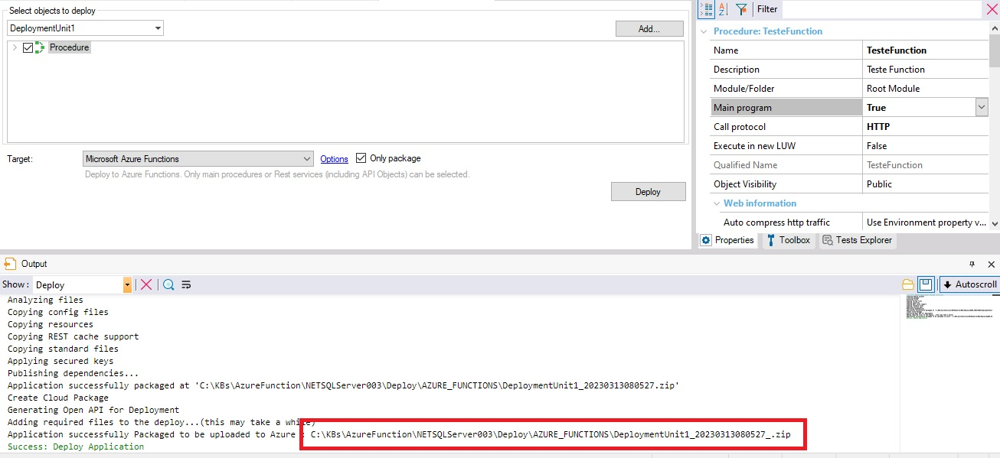
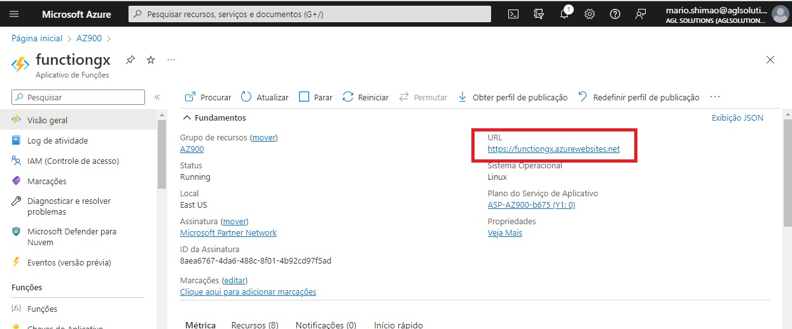
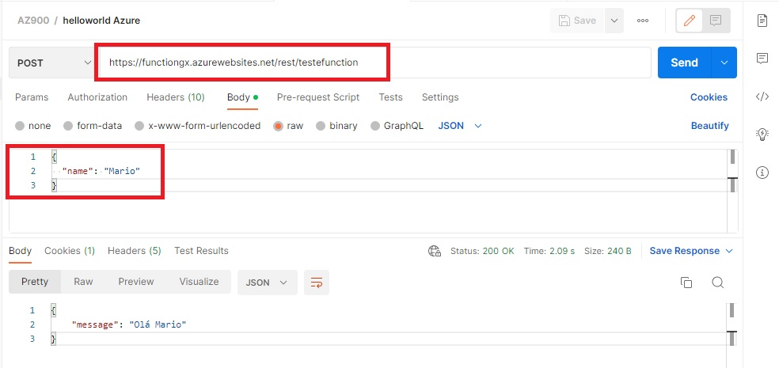

# Atividade 2 - Criando uma Azure Function com o Genexus

Para essa atividade vamos utilizar o Genexus 18 e seguir a documentação do wiki da Genexus.

- [Documentação Genexus Azure Functions](https://wiki.genexus.com/commwiki/servlet/wiki?47430,Azure+Functions)

1 - Entre no portal do Azure  usando a mesma conta usada para ativar a área restrita.

2 - Em Serviços do Azure, selecione Criar um recurso.

3 - No menu, selecione Computação, procure Aplicativo de Funções e selecione-o. Selecione o botão Criar. O painel Criar Aplicativo de Funções é exibido.

 - Na guia **Básico**, insira os valores a seguir para cada configuração.

|Configuração|Valor|
|--|--|
|**Detalhes do projeto**||
|Subscription|Assinatura do Concierge|
|Grupo de recursos|Na lista suspensa, selecione [nome do grupo de recursos da área restrita]|
|**Detalhes da Instância**||
|Nome da função|funcaogx9999 (no lugar de 9999 colocar um número aleatório para evitar colisão de nome)|
|Publicação|Código|
|Pilha de runtime|Net|
|Versão|6(LTS) Isolated (deve ser essa versão para evitar erro)|
|Região|a default|
|**Sistema Operacional**||
|Sistema Operacional|Linux|
|**Plano**||
|Tipo de plano|Consumo(Serverless)|
<br>

- Na guia **Hospedagem, insira os valores a seguir para cada configuração.

|Configuração|Valor|
|--|--|
|Conta de Armazenamento|Utilizar o valor padrão informado|
<br>

- Na guia Rede, insira os valores a seguir para cada configuração.

|Configuração|Valor|
|--|--|
|Ativar acesso público|Ativado|
<br>

- Na guia Monitoramento, insira os valores a seguir para cada configuração.

|Configuração|Valor|
|--|--|
|Habilitar o Application Insights|Sim|
|Application Insights|Utilizar o valor padrão informado|
<br>

- Na guia Implantação, insira os valores a seguir para cada configuração.

|Configuração|Valor|
|--|--|
|**Configurações do GitHub Actions**||
|Implantação contínua|Desabilitar|
<br>

- Na guia Rótulos, insira os valores a seguir para cada configuração.

|Configuração|Valor|
|--|--|
|Nome|Ambiente|
|Valor|Desenvolvimento|
<br>

- Na guia Revisar + criar, clicar em Criar

4 - Criar uma procedure chamada **TesteFunction** no Genexus com **.NET Core versão 6** com o código a abaixo:
````
parm(in:&name, out: &message);

if &name.Length() = 0 
	&message = 'Informar o nome'
else 
	&message = 'Olá ' + &name
endif
````
Com as seguintes propriedades:
|Propriedade|Valor|
|--|--|
|Main program|True|
|Call protocol|HTTP|
|Expose as Web Service|True|
|REST Protocol|True|
|Generate OpenAPI interface|Yes|
<br>

5 - Gerar um deploy indicando a procedure **TesteFunction**, o target deve **Microsoft Azure Functions** e a opção **Only package** deve ser selecionada.
Nas opções do deploy configurar as seguintes propriedades:

|Propriedade|Valor|
|--|--|
|Function app|funcaogx9999 (nome da função criada no portal do Azure)|
|Resource group|[nome do grupo de recursos da área restrita]|
|Trigger Type|Http|

Clicar em **Deploy**, serão gerados 2 arquivos, o arquivo que tiver o seguinte formato **nomedodeploy_data_.zip** terá o conteúdo publicado.



<br>

6 - Utilizar o Filezilla para realizar o upload do código para o Azure. 

- https://filezilla-project.org/
<br>


7 - Conectar no Azure utilizando as credencias de ftp da função criada no Azure. Abrir a função e clicar na opção **Centro de Implantação** e na aba **FTPS Credentials**, utilizar o endpoint, o usuário e senha para conectar.
<br>

8 - Ir até a pasta onde foi gerado o arquivo **nomedodeploy_data_.zip**, extrair o conteúdo compactado, e publicar utilizando o Filezilla.
<br>


9 - Clicar na opção **Visão geral**, e copiar a url do aplicativo de funções.



Abrir o Postman e configurar o um request post com url copiada mais **api/TesteFunction** e no corpo do request a mensagem abaixo:

````Json
{
    "name":"Mario"
}
````

Ao clicar em **Send**, deverá ser retornado a mensagem ** Olá Mario**.


